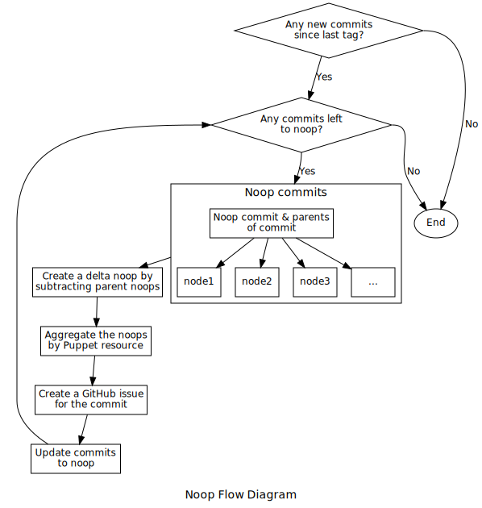
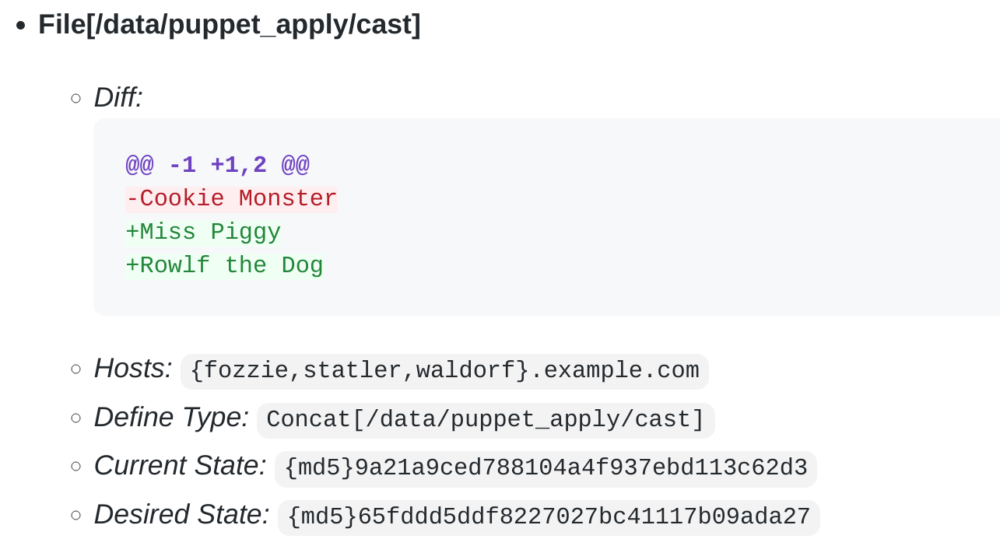
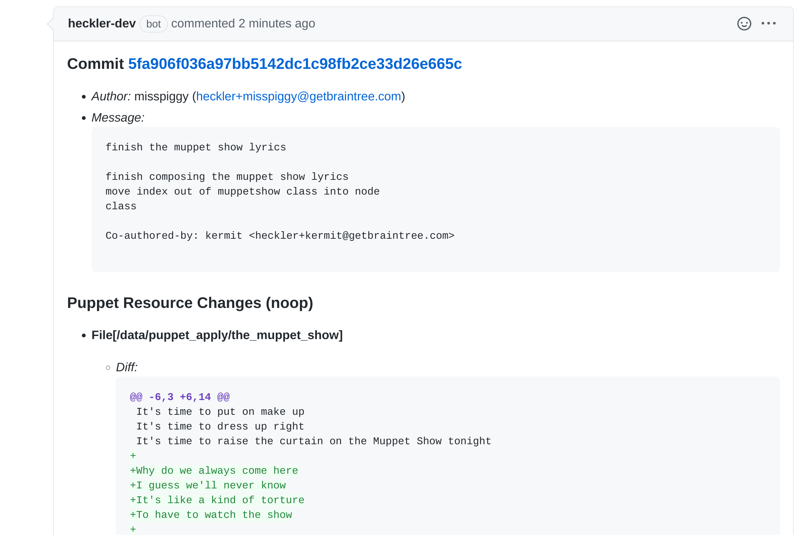

# Heckler

Heckler's aim is to correlate commits with Puppet noop changes, allowing
for noop review and approval prior to applying.

## Motivation

*Claim*: Reviewing Puppet commits and testing changes in development
provides an incomplete picture of the changes which will be evinced in
production due to the differences in contextual data between
environments. Reviewing Puppet noop outputs for production provides an
important safeguard against any unforeseen affects of a commit.

## Components

Below are the components that make up the Heckler system.

  - `hecklerd`: central daemon responsible for running noops and applies
    across an environment.

  - `rizzod`: daemon which runs on every node and executes puppet noops
    or applies as directed by `hecklerd`.

  - `heckler`: cli client used to make ad hoc requests against
    `hecklerd`; at present it is not a central part of the automated
    workflow, but serves primarily as a debugging tool.

## Deployment

Heckler is deployed on a central server, the hecklerd component and
heckler cli. The rizzod client is deployed to every server which you
intend to noop against. Currently this is done through the Debian
packaging provided in the repo. Hecklerd makes GRPC connections to
rizzod to initiate the noops and applies.

## Development

Development is primarily driven through the `Makefile`, simply run
`make` to see the available targets after cloning the repo. All
dependencies are vendored, except the CGO dependencies because that is
not possible with Go's built-in tooling.

Compilation is done in a docker container to ease dependency management,
run `make docker-build` to kick off the build.

## License

Heckler is available as open source under the terms of the [MIT
License](http://opensource.org/licenses/MIT).

## Process

### Overview

1.  Runs a puppet apply with the `--noop` option on every host for every
    new commit in a git repository.
2.  Correlates a commit with a noop change by creating a delta noop
3.  Aggregates noops changes which are identical
4.  Seeks review and approval of the noop change
5.  Applies approved commits

### Flow Diagram



### Noop Every Commit

Use the Puppet Report from a noop to determine changes.

```yml
logs:
  - level: notice
    message: <DIFF_OUTPUT>
    source: "/Stage[main]/Haproxy/File[/etc/haproxy/haproxy.cfg]/content"
resource_statuses:
  File[/etc/haproxy/haproxy.cfg]:
    title: "/etc/haproxy/haproxy.cfg"
    file: "modules/haproxy/manifests/init.pp"
    resource: File[/etc/haproxy/haproxy.cfg]
    changed: true
  Service[haproxy]:
    title: haproxy
    file: "modules/haproxy/manifests/init.pp"
    resource: Service[haproxy]
    changed: true
```

### Correlate Commit with Noop Changes

Heckler noops the commit requested as well as the parent commits of a
requested noop. The parents are nooped so that the resource changes of
parent commits can be subtracted from the target commit. This
subtraction can be visualized by showing a diff between the noop & the
delta noop.

### Diff of Noop & Delta Noop

``` diff
--  **File[/data/puppet_apply/laughtrack]**
-    - *Diff:*
-      @@ -0,0 +1,2 @@
-      +Wacka
-      +Wacka
-    - *Hosts:* `{fozzie,statler,waldorf}.example.com`
-    - *Define Type:* `Muppetshow::Episode[One]`
-    - *Current State:* `{md5}d41d8cd98f00b204e9800998ecf8427e`
-    - *Desired State:* `{md5}15d4a7e90a35a1b9d8d69deecbf9f7d0`
-
 -  **File[/var/www/html/index.html]**
     - *Diff:*
       @@ -1 +1 @@
       -Muppets
       +Fozzie
     - *Hosts:* `fozzie.example.com`
     - *Current State:* `{md5}e5deafb6425abb47e5a1efef8b969fb8`
     - *Desired State:* `{md5}a148678410c6e6abb9fe0103391f3692`
```

### Aggregate Noops

Heckler aggregates identical noop changes across nodes.



### Seeks Review and Approval of Noop Changes

Ownership is driven by the *CODEOWNERS* file in the puppet source repo.
Ownership may be specified by node, file, or module. Owners are allowed
to approve noop changes.

``` shell
$ cat CODEOWNERS
nodes/fozzie.pp @braintree/muppets
nodes/statler.pp @braintree/muppets
nodes/waldorf.pp @braintree/muppets
/modules/muppetshow/** @misspiggy
```

 

### Apply Commits

Heckler confirms that each noop has been approved by an owner and then
applies the commits to an environment. Heckler supports staged roll outs
of node sets which are specified by the user.

    apply_set_order:
      - canaries
      - all

### Building/Running Hecklerd on Mac
1. check GO111MODULE value in go env

	go env | grep MOD
	if GO111MODULE="off" then export GO111MODULE=on

2. build libgit2 in dynamic

	chmod +x build-libgit2-dynamic
	chmod +x script/build-libgit2-dynamic.sh
	./build-libgit2-dynamic

3. Running hecklerd main.go on local mac dev env

	export GO111MODULE=on
	export CGO_LDFLAGS='-g -O2 -Wl,-rpath,<<local_dev_folder>>/heckler/vendor/github.com/libgit2/git2go/v31/dynamic-build/install/lib'
	export PKG_CONFIG_PATH='<<local_dev_folder>>/heckler/vendor/github.com/libgit2/git2go/v31/dynamic-build/install/lib/pkgconfig'

	go run cmd/hecklerd/main.go  | tee output_`date +%d-%m-%Y-%s`.log
